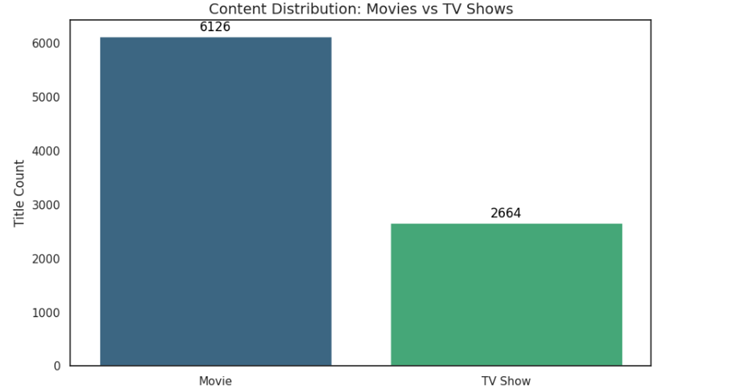
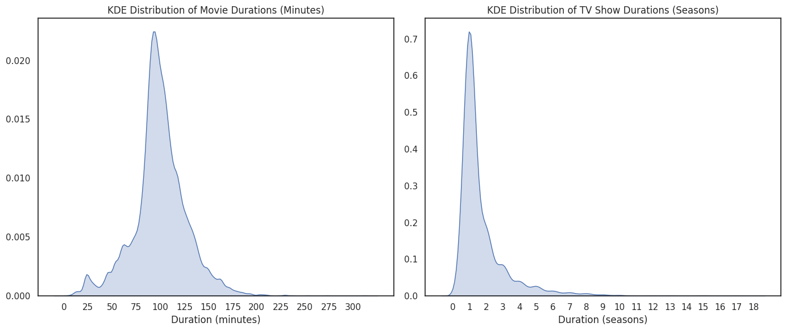
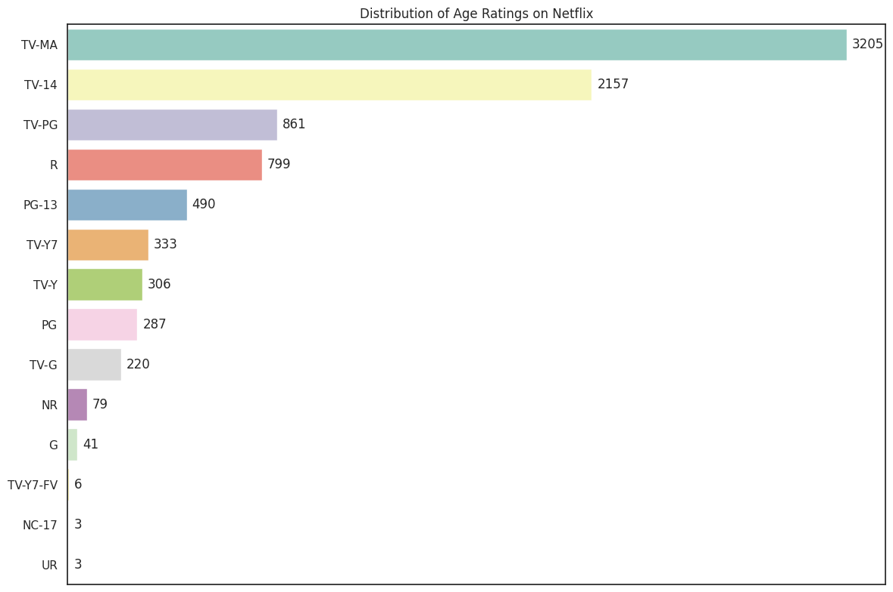
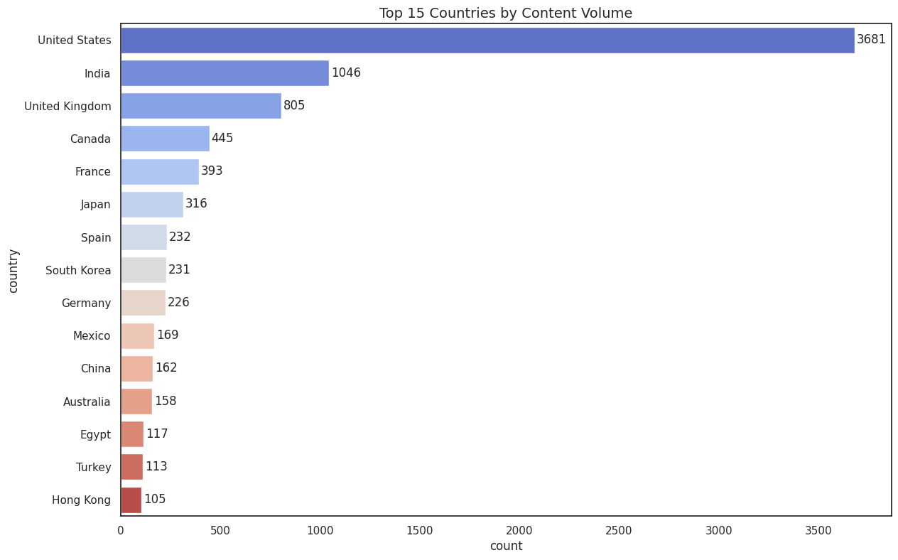

# 🎬 Netflix Exploratory Data Analysis: Content & Trends

A comprehensive, end-to-end Python-based Exploratory Data Analysis (EDA) on the Netflix Catalog dataset. This project uncovers structural distribution patterns, content evolution trends over time, target demographics, and localized production centers within Netflix's global platform.

---

## 📌 Table of Contents
1. [Project Overview](#-project-overview)
2. [Dataset Architecture](#-dataset-architecture)
3. [Data Wrangling & Pipeline Cleanliness](#data-wrangling--pipeline-cleanliness)
4. [Exploratory Data Analysis & Visualizations](#-exploratory-data-analysis--visualizations)
5. [Key Tactical Insights](#-key-tactical-insights)
6. [Tech Stack & Execution Environment](#-tech-stack--execution-environment)

---

## 🎯 Project Overview
This repository provides an in-depth exploratory breakdown of the Netflix catalog up to 2021. The objective is to convert raw metadata (cast, country, release year, genre) into structural insights regarding how the streaming giant balances its programming, targets specific age demographics, scales its content globally, and transitions its focus between standalone movies and serialized TV shows.

---

## 📁 Dataset Architecture
The project utilizes the `netflix_titles.csv` dataset, which comprises **8,807 original observation rows** and **12 descriptive features**:

| Feature Name | Type | Description |
| :--- | :--- | :--- |
| `show_id` | Object | Unique identifier for each title (Movie/TV Show) |
| `type` | Object | Broad categorization (`Movie` or `TV Show`) |
| `title` | Object | Official title of the content |
| `director` | Object | Director(s) involved in the production |
| `cast` | Object | Comma-separated list of featured actors |
| `country` | Object | Production countries involved |
| `date_added` | Object | Date the title was officially made available on Netflix |
| `release_year` | Integer | Actual calendar year the content was originally released |
| `rating` | Object | Target maturity and demographic rating (e.g., TV-MA, PG-13) |
| `duration` | Object | Length measured in total minutes (Movies) or total seasons (TV Shows) |
| `listed_in` | Object | Categorized genres/topics |
| `description`| Object | Summary synopsis of the program |

---

## 🛠️ Data Wrangling & Pipeline Cleanliness

To ensure visual accuracy and mathematical validity, the notebook implements a strict data pre-processing and cleaning phase:

### 1. Missing Value Diagnosis & Treatment
Initial scanning revealed significant structural missing data. The project avoids blind deletion by handling columns dynamically:
* **High-Volume Text Missingness:** `director` (2,634 missing), `cast` (825 missing), and `country` (831 missing) are structurally imputed with the placeholder string `'Unknown'` to preserve the other descriptive features of the records.
* **Low-Volume Dropping:** Records with missing values in `date_added` (10 rows), `rating` (4 rows), and `duration` (3 rows) constitute less than 0.2% of the total volume and are dropped safely to prevent data frame indexing errors.
* **Post-Cleaning Balance:** The final analytical pipeline operates on a robust data frame of **8,790 records**.

### 2. Feature Engineering & Advanced Value Extraction
* **String Splitting:** Fields containing multi-valued strings separated by commas (e.g., countries, genres) are isolated using `.str.split(', ')` to calculate accurate standalone frequencies.
* **Duration Parsing:** Since the `duration` column stores string values combined with metrics (`min` for Movies, `Season` for TV Shows), the notebook isolates these sub-datasets to extract numerical values (`.str.replace()`, `.astype(int)`) for exact statistical analysis.

---

## 📊 Exploratory Data Analysis & Visualizations

The notebook systematically maps four core analytical components:

### 1. Content Distribution Matrix (`Movie` vs `TV Show`)
* **Methodology:** Grouped volume count and explicit relative ratio visualization using Seaborn.
* **Observation:** The portfolio remains highly dominated by standalone feature films over continuous TV series.
  * **Movies:** 6,126 unique titles (~69.7%)
  * **TV Shows:** 2,664 unique titles (~30.3%)

  

### 2. Content Duration & Format Length Analysis
* **Methodology:** Segmenting the dataset by `type` and extracting the numerical lengths to chart distribution density.
* **Observation:** 
  * **Movies:** The length distribution forms a classic bell curve (normal distribution) peaking around **90-100 minutes**, which fits the traditional sweet spot for feature films.
  * **TV Shows:** An overwhelming majority of episodic content consists of only **1 Season**, underscoring Netflix's high cancellation rate or preference for limited series over long-running multi-season productions.

  

### 3. Target Demographic & Maturity Rating Profile
* **Methodology:** Re-ordering and value sorting of the categorical `rating` field.
* **Observation:** Adult-focused and mature audience programming forms the core anchor of the platform, with **`TV-MA`** (Mature Audiences) and **`TV-14`** (Parents Strongly Cautioned) representing the overwhelmingly vast majority of the catalog.

  

### 4. Localization & Top Production Hubs
* **Methodology:** Text unwrapping of the `country` column to counter multi-national productions.
* **Execution:** Horizontal distribution analysis of the top 10 contributing global markets.
* **Observation:** The **United States** stands as the definitive global production hub for Netflix content, followed closely by **India** (highly dominated by feature films), and the **United Kingdom**.

  

---

## 💡 Key Tactical Insights

* **The Production Tilt:** While Netflix has invested heavily in binge-worthy serialized episodic content (`TV Shows`), standalone `Movies` still make up more than two-thirds of the aggregate active catalog.
* **Binge vs. Retention Dynamics:** The structural dominance of 1-Season TV Shows indicates that the platform relies on a constant influx of *new* titles to combat user churn, rather than sustaining long-term series development.
* **Audience Dominance:** The streaming model thrives on adult audiences. General/Family or child-restricted ratings make up a minor footprint compared to the massive ecosystem of `TV-MA` and `TV-14` content.
* **Global Footprint:** Despite heavy regional content acquisitions across Latin America, Asia, and Europe, production relies heavily on the North American hub, alongside significant standalone film generation out of Bollywood (India).

---

## 💻 Tech Stack & Execution Environment

* **Language Platform:** Python 3.x
* **Core Libraries Used:**
  * `pandas` - High-performance data frame parsing and value transformations.
  * `matplotlib.pyplot` - Canvas definition and structural layout styling.
  * `seaborn` - High-level interface for statistical thematic categorical plots.
* **Environment Compatibility:** Designed with dynamic file pathways adaptable for local Jupyter notebook runtimes or cloud-based instances (Google Colab).

---
*Analysis generated as part of the Netflix Catalog Exploratory Data Engineering Series.*
